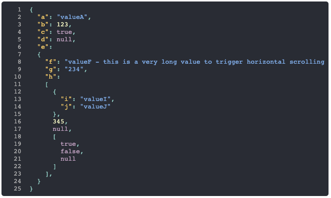

# JSON View for React

A React component that displays a JSON View with the following goals:

* Do not rely on `JSON.stringify`.   Walk the tree instead.
* The creation of the elements can be overriden, making it easy to:
  * use `styled-components` (or other css-in-javascript approaches).
  * change the outer shell, so you can integrate it better into your existing app.
* 100% test coverage
* A learning project to understand how to publish and consume individual React components without the commitment of storybook or bit etc.



## Usage

Import and then pass an object to the `obj` property.

```javascript
import React from 'react'
import { JsonView } from 'json-view-for-react'

function Example () {
  return <JsonView obj={{ hello: 'world' }} showLineNumbers />
}
```

Property Name | Description
---|---
obj | A JSON object to be displayed.
showLineNumbers | An optional boolean that indicates if line numbers should be displayed next to each line.
onCreateElement | An optional function (contentType, content, key, jsonCodeInfo) that can return a bespoke element for any given contentType rather than use the defaults.  If the function does not return a value that satisfies React.isValidElement then the default will be used instead.  So you don't have to support every contentType value.

### Styling

The component will add classes to the default elements that it creates.  So you can style it by adding the following CSS, either to your build system or just to the main CSS file.  Obviously you can change the colors to suit your requirements.

```css
   <style>
     code.json-view-for-react {
      display: block;
      padding: 0.5rem;
      background-color: rgb(40, 44, 52);
      color: rgb(136, 198, 190);
      overflow-x: scroll;
    }

    code.json-view-for-react .line { white-space: nowrap; }

    code.json-view-for-react .str { color: rgb(121, 182, 242); }
    code.json-view-for-react .num { color: rgb(255, 255, 200); }
    code.json-view-for-react .bool { color: rgb(197, 165, 197); }
    code.json-view-for-react .null { color: rgb(197, 165, 197); }
    code.json-view-for-react .prop { color: rgb(250, 200, 99); }

    code.json-view-for-react .ln {
      display: inline-block;
      padding-right: 1rem;
      color: rgb(178, 178, 178);
      text-align: right;
      user-select: none;
    }
   </style>
```

Alternatively, you can use the onCreateElement function property to create your own elements.  This allows you to use CSS-in-JS mechanisms like styled-components.

### onCreateElement function

* **contentType** - one of the content type constants that are exported from the library and defined below.
* **content** - the content that should be placed inside the newly created element.  For example: `return <span>{content}</span>`
* **key** - the key that should be assigned to the element.  This will only be supplied, and should only be applied to the returned element, when the contentType is `LINE`.  The key will be `null` for other `contentType`'s so do not apply that because `{key=null}` is not helpful.

contentType | Description
---|---
CODE | A wrapper for the code block.
LINE | A wrapper for an individual line of code.
STRING_VALUE | A string value.
NUMBER_VALUE | A number value.
BOOLEAN_VALUE | A boolean value, either true or false.
NULL_VALUE | A null value.
PROPERTY_VALUE | The name of a property.
LINE_NUMBER | A line number.

The example below creates a styled CODE element, using React inline styles, rather than the default one that relies on CSS.  Note that the `json-view-for-react` className is included so that the CSS for other elements still works.

```javascript
  const codeStyle = {
    display: 'block',
    padding: '0.5rem',
    backgroundColor: 'rgb(40, 44, 52)',
    color: 'rgb(136, 198, 190)',
    overflowX: 'scroll',
    borderRadius: '5px'
  }

  function onCreateElement (contentType, content) {
    if (contentType === CODE) {
      return <code className='json-view-for-react' style={codeStyle}>{content}</code>
    }
  }
```

## Development

Run `npm start` to launch a test page with hot reload.

Run `npm test` to run the tests, 100% coverage required to pass.

Run `npm run build` to build the distributable version that can be imported into other react projects.

## Deployment

A push to the master branch triggers Github Actions CI/CD to run.

If the tests run successfully then the library is versioned, released on Github and published in NPM.

The versioning is semantic based on the presence of `--fix`, `--feat` or `--break` within the commit comments since the previous release.

## License

MIT